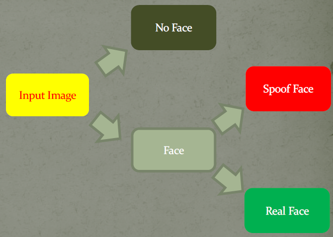
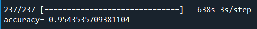

# Facial Anti-Spoofing Detection
a CNN facial anti-spoofing detection project

### Library and package
Python TensorFlow + Keras API

### IDE
Anaconda Spyder

#### Goal

#### Test Result
Test accuracy = 0.9544
